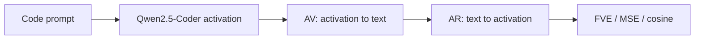

# Natural Language Autoencoders for Code-Model Activations

This repository is my submission for the KTH AI4Code PhD recruitment task. I reimplemented a compact Natural Language Autoencoder (NLA)-style pipeline and applied it to activations from a small open-source code language model.

The central question is:

> Can a natural-language round trip recover meaningful information from internal activations of a small code model, and do the explanations remain useful under code transformations?

## Where to look first

The README is the short final report. The detailed execution trail is split as follows:

- [docs/project_plan.md](docs/project_plan.md) — current roadmap and completed phases.
- [docs/research_log.md](docs/research_log.md) — central narrative log of decisions, challenges, and results.
- [docs/phase_results/](docs/phase_results/) — phase-by-phase reports with quantitative results.
- [experiments/](experiments/) — lightweight CSV experiment registries and metric summaries.
- [docs/manual_installation.md](docs/manual_installation.md) — setup and reproduction instructions.

Large raw artifacts are intentionally not committed; the repository keeps reproducible code and compact documentation instead.

## Code, models, and data links

Core implementation:

- [src/nla_code_interp/qwen_models.py](src/nla_code_interp/qwen_models.py) — Qwen AV/AR modules and checkpoint loaders.
- [src/nla_code_interp/metrics.py](src/nla_code_interp/metrics.py) — FVE, MSE, cosine, and baseline metrics.
- [scripts/extract_activations.py](scripts/extract_activations.py) — activation extraction from the target model.
- [scripts/train_qwen_joint_nla.py](scripts/train_qwen_joint_nla.py) — aligned AV/AR training.
- [scripts/train_qwen_av_reward_rl.py](scripts/train_qwen_av_reward_rl.py) — reward-driven AV optimization.
- [scripts/run_qwen_nla_loop.py](scripts/run_qwen_nla_loop.py) — final NLA loop evaluation.

External model and data sources:

- Main model: [Qwen/Qwen2.5-Coder-1.5B-Instruct](https://huggingface.co/Qwen/Qwen2.5-Coder-1.5B-Instruct).
- Smoke-test model: [Qwen/Qwen2.5-Coder-0.5B-Instruct](https://huggingface.co/Qwen/Qwen2.5-Coder-0.5B-Instruct).
- Training-data source family: [CodeSearchNet](https://github.com/github/CodeSearchNet).
- Controlled multilingual source family: [HumanEval-X / CodeGeeX](https://github.com/THUDM/CodeGeeX).
- Reference method: [Natural Language Autoencoders](https://transformer-circuits.pub/2026/nla/index.html) and the [official implementation](https://github.com/kitft/natural_language_autoencoders).

## Summary of the approach

I used `Qwen/Qwen2.5-Coder-1.5B-Instruct` as the main target model and extracted residual-stream hidden states from layer 19 at the final non-padding token. The task domain is function-level code understanding.

The implemented NLA has two paired components:

- **Activation Verbalizer (AV):** maps an activation vector to natural language by projecting the activation into the Qwen embedding space and prepending it as a pseudo-token.
- **Activation Reconstructor (AR):** maps generated text back to an activation vector using Qwen hidden states plus a projection head.

The final pipeline is:



I started with DistilBERT/DistilGPT2 debug baselines, then moved to Qwen-based LoRA components. The final system adds a reward-driven AV stage inspired by the original NLA RL objective:

```text
reward = -MSE(L2_normalize(AR(AV(a))), L2_normalize(a))
```

This is not a full reproduction of Anthropic's large-scale GRPO training setup. It is a single-GPU, resource-constrained approximation that preserves the AV/AR round-trip structure and adds a reconstruction-reward optimization stage.

## Why these choices?

`Qwen2.5-Coder-1.5B` is small enough to run on my RTX 3090 Ti 24GB setup, but strong enough to represent code semantics better than tiny generic language models. I also used `Qwen2.5-Coder-0.5B` for smoke tests before running the final 1.5B experiments.

The experiments were run on a single workstation with one NVIDIA RTX 3090 Ti 24GB GPU, a 64-core CPU, and 128GB RAM. The full hardware capacity was not always saturated, but this records the reproducibility envelope for the reported runs.

The datasets were chosen to test both ordinary reconstruction and generalization:

- CodeSearchNet-style Python functions for train/validation.
- HumanEval-X-derived examples for controlled tests.
- Surface-shift test: identifier-renaming transformations.
- Language-shift test: cross-language Python/C++/Java-style examples.

Large artifacts such as raw data, extracted activations, and checkpoints are not committed. Their paths and generation commands are documented in [docs/manual_installation.md](docs/manual_installation.md).

## Main quantitative results

Metric: **Fraction of Variance Explained (FVE)**. A mean baseline has FVE = 0. Higher is better.

### Validation progression

| System | Validation FVE | Validation MSE | Notes |
|---|---:|---:|---|
| DistilBERT/DistilGPT2 debug loop | -0.3538 | 0.3176 | End-to-end but weak |
| Qwen 0.5B medium after adaptation | 0.4941 | 0.1317 | Strong medium-scale signal |
| Qwen 1.5B aligned joint run | 0.3616 | 0.1497 | Full train/validation |
| Qwen 1.5B reward-RL AV | **0.4574** | **0.1273** | Best final validation result |

The final reward-driven AV stage improved over the 1.5B aligned joint checkpoint:

```text
FVE: 0.3616 -> 0.4574
MSE: 0.1497 -> 0.1273
```

### Controlled test results, final reward-RL system

| Split | FVE | MSE | Mean baseline MSE | Result |
|---|---:|---:|---:|---|
| `test_indomain` | **0.4009** | **0.0792** | 0.1321 | Beats mean |
| `test_surface_shift` | **0.4804** | **0.1026** | 0.1975 | Beats mean |
| `test_language_shift` | -4.6473 | 0.1079 | 0.0191 | Fails mean |

The system generalizes well to in-domain and surface-level code transformations, but language-shift remains difficult.

## Most interesting finding

The initial supervised AV/AR loop was not enough. A model could generate plausible-looking descriptions while still losing activation-specific information. The big improvement came when AR was adapted to AV-generated explanations, and then AV was further optimized with reconstruction reward.

This suggests that, for small models and limited compute, the useful signal is not just natural-language imitation. The important pressure is the round-trip constraint:

```text
Can this text help reconstruct the activation that produced it?
```

## Qualitative observations

The final system reconstructs activations well, but its text is not always faithful. Some generated explanations are short or generic. Example failure pattern:

```text
Target: Return package author and version as listed in init.py.
Generated: Get the default value for an argument.
```

This is an important limitation: the system can learn activation-preserving textual codes that are not always high-quality human explanations. I therefore report reconstruction success and explanation faithfulness separately.

## Reproducibility

Manual setup is documented in:

- [docs/manual_installation.md](docs/manual_installation.md)
- [docs/research_log.md](docs/research_log.md)
- [docs/phase_results/](docs/phase_results/)

Core scripts are linked in [Code, models, and data links](#code-models-and-data-links).

Representative final commands:

```bash
python scripts/train_qwen_joint_nla.py \
  --activation_dir outputs/activations/train_qwen25_coder_15b_l19_ctx512 \
  --validation_activation_dir outputs/activations/validation_qwen25_coder_15b_l19_ctx512 \
  --output_dir outputs/checkpoints/qwen_joint/final_qwen15b_full_e20 \
  --model_name_or_path Qwen/Qwen2.5-Coder-1.5B-Instruct \
  --epochs 20 \
  --batch_size 8 \
  --gradient_accumulation_steps 8 \
  --dtype bfloat16
```

```bash
python scripts/train_qwen_av_reward_rl.py \
  --activation_dir outputs/activations/train_qwen25_coder_15b_l19_ctx512 \
  --validation_activation_dir outputs/activations/validation_qwen25_coder_15b_l19_ctx512 \
  --joint_checkpoint_dir outputs/checkpoints/qwen_joint/final_qwen15b_full_e20 \
  --output_dir outputs/checkpoints/qwen_rl/final_qwen15b_av_reward_rl \
  --epochs 3 \
  --batch_size 8 \
  --gradient_accumulation_steps 2 \
  --learning_rate_av 5e-5 \
  --dtype bfloat16
```

The exact experiment chronology is in [experiments/](experiments/) and [docs/research_log.md](docs/research_log.md).

## What remains uncertain

1. The language-shift setting is not solved.
2. Reward optimization improves reconstruction, but not necessarily semantic faithfulness.
3. This is a compact approximation of the original NLA training, not a full-scale reproduction.
4. More robust future work would add stronger text-quality regularization, cross-language adaptation data, and a closer GRPO-style AV optimization loop.

## Final takeaway

A small Qwen-based NLA can recover meaningful information from code-model activations. The reconstruction-reward stage is crucial: it moves the system beyond supervised explanation imitation and produces the strongest validation and test results. The method works well for in-domain and surface-shift code examples, while cross-language generalization remains the main open limitation.
